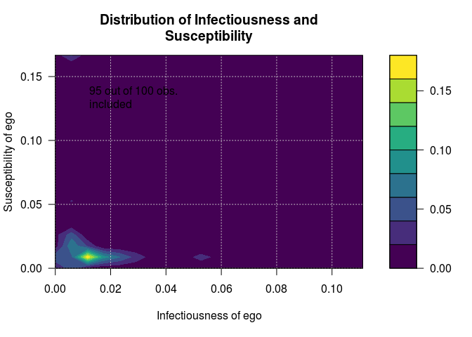

netdiffuseR: Network Analysis for Diffusion of Innovations
==========================================================

[](https://travis-ci.org/USCCANA/netdiffuseR) [](https://ci.appveyor.com/project/gvegayon/netdiffuser) [](https://codecov.io/github/USCCANA/netdiffuseR?branch=master)

This package contains functions useful for analyzing network data for diffusion of innovations applications.

The package was developed as part of the paper Thomas W. Valente, Stephanie R. Dyal, Kar-Hai Chu, Heather Wipfli, Kayo Fujimoto, *Diffusion of innovations theory applied to global tobacco control treaty ratification*, Social Science & Medicine, Volume 145, November 2015, Pages 89-97, ISSN 0277-9536 (available [here](http://www.sciencedirect.com/science/article/pii/S027795361530143X))

Functions include selection, susceptibility & infection, etc.

Installation
------------

Using the `devtools` package, you can install `netdiffuseR` dev version as follows

``` r
devtools::install_github('USCCANA/netdiffuseR')
```

Examples
--------

This example has been taken from the package's vignettes:

``` r
library(netdiffuseR)
```

### Infectiousness and Susceptibility

``` r
# Generating a random graph
set.seed(1234)
n <- 100
nper <- 20
graph <- rgraph_er(n,nper, p=.40, undirected = FALSE)
toa <- sample(1:(1+nper-1), n, TRUE)
head(toa)
```

    ## [1] 19  7  8  1 17 14

``` r
# Visualizing distribution of suscep/infect
out <- plot_infectsuscep(graph, toa, K=1, logscale = TRUE)
```



### Threshold

``` r
# Generating a random graph
set.seed(123)
n <- 6
nper <- 5
toa  <- sample(2000:(2000+nper-1), n, TRUE)
nper <- length(unique(toa))
graph <- rgraph_er(n,nper, p=.3, undirected = FALSE)
adopt <- toa_mat(toa)

# Computing exposure
expos <- exposure(graph, adopt$cumadopt, undirected = FALSE)

# Threshold with fixed vertex size
plot_threshold(graph, expos, toa, undirected = FALSE)
```


``` r
# Threshold with vertex size = avg degree
cex <- rowMeans(dgr(graph))
cex <- (cex - min(cex) + 1)/(max(cex) - min(cex) + 1)/2
plot_threshold(graph, expos, toa, vertex.cex = cex)
```


### Diffusion process

``` r
plot_diffnet(graph, adopt$cumadopt)
```

    ## Loading required package: SparseM
    ## 
    ## Attaching package: 'SparseM'
    ## 
    ## The following object is masked from 'package:base':
    ## 
    ##     backsolve


To-do list
----------

-   Import/Export functions for interfacing other package's clases, in particular: `statnet` set (specially the packages `networkDynamic` and `ndtv`), `igraph` and `Rsiena`.
-   Populate the tests folder.
-   What to do with the `NA`/`NULL`/`NaN`/`Inf` cases in the following functions:
    -   `infection`, `susceptibility`
    -   `struct_equiv`
    -   `threshold`
    -   `exposure`
    -   `hazard_rate`
    -   `toa_mat`
-   How to include *never adopters*
-   Use spells? (`select_egoalter` would use this)
