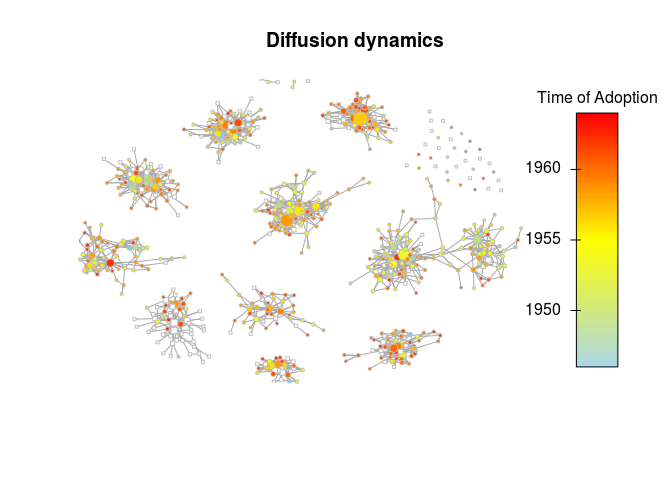

netdiffuseR: Network Analysis for Diffusion of Innovations
==========================================================

[](https://travis-ci.org/USCCANA/netdiffuseR) [](https://ci.appveyor.com/project/gvegayon/netdiffuser) [](https://codecov.io/github/USCCANA/netdiffuseR?branch=master) [](http://cran.rstudio.com/web/packages/netdiffuseR/index.html) [](http://cran.r-project.org/package=netdiffuseR)

This package contains functions useful for analyzing network data for diffusion of innovations applications.

The package was developed as part of the paper Thomas W. Valente, Stephanie R. Dyal, Kar-Hai Chu, Heather Wipfli, Kayo Fujimoto, *Diffusion of innovations theory applied to global tobacco control treaty ratification*, Social Science & Medicine, Volume 145, November 2015, Pages 89-97, ISSN 0277-9536 (available [here](http://www.sciencedirect.com/science/article/pii/S027795361530143X))

From the description:

> Empirical statistical analysis, visualization and simulation of network models of the diffusion of innovations. The package implements algorithms for calculating network diffusion statistics such as transmission rate, hazard rates, exposure models, network threshold levels, infectiousness (contagion), and susceptibility. The package is inspired by work published in Valente, et al., (2015) <DOI:10.1016/j.socscimed.2015.10.001>; Valente (1995) <ISBN:9781881303213>, Myers (2000) <DOI:10.1086/303110>, Iyengar and others (2011) <DOI:10.1287/mksc.1100.0566>, Burt (1987) <DOI:10.1086/228667>; among others.

**Acknowledgements**: netdiffuseR was created with the support of grant R01 CA157577 from the National Cancer Institute/National Institutes of Health.

News
----

Changelog can be view [here](NEWS.md).

-   \[2016-03-16\] Next CRAN release scheduled for April 11th 2016 (after the workshop).
-   \[2016-02-18\] **netdiffuseR** vers 1.16.2 is now on CRAN!
-   \[2016-02-18\] We will be offering a workshop at the 2016 SUNBELT Conference (checkout the full list of workshops [here](http://insna.org/sunbelt2016/program/)).

Installation
------------

### CRAN version

To get the CRAN (stable) version of the package, simple type

``` r
install.packages("netdiffuseR")
```

### Bleeding edge version

If you want the latest (unstable) version of **netdiffuseR**, using the `devtools` package, you can install `netdiffuseR` dev version as follows

``` r
devtools::install_github('USCCANA/netdiffuseR', build_vignettes = TRUE)
```

You can skip building vignettes by setting `build_vignettes = FALSE` (so it is not required).

For the case of OSX users, there seems to be a problem when installing packages depending on `Rcpp`. This issue, developed [here](https://github.com/USCCANA/netdiffuseR/issues/3), can be solved by open the terminal and typing the following

``` sh
curl -O http://r.research.att.com/libs/gfortran-4.8.2-darwin13.tar.bz2
sudo tar fvxz gfortran-4.8.2-darwin13.tar.bz2 -C /
```

before installing the package through `devtools`.

Examples
--------

This example has been taken from the package's vignettes:

``` r
library(netdiffuseR)
```

### Infectiousness and Susceptibility

``` r
# Generating a random graph
set.seed(1234)
n <- 100
nper <- 20
graph <- rgraph_er(n, nper, .5)
toa <- sample(c(1:(1+nper-1), NA), n, TRUE)
head(toa)
```

    ## [1] 20  7  9  1 17 14

``` r
# Creating a diffnet object
diffnet <- as_diffnet(graph, toa)
diffnet
```

    ## Dynamic network of class -diffnet-
    ##  # of nodes         : 100 (1, 2, 3, 4, 5, 6, 7, 8, ...)
    ##  # of time periods  : 20 (1 - 20)
    ##  Type               : directed
    ##  Final prevalence   : 0.95
    ##  Static attributes  : -
    ##  Dynamic attributes : -

``` r
summary(diffnet)
```

    ## Diffusion network summary statistics
    ## -----------------------------------------------------------------------
    ##  Period  Adopters Cum Adopt. Cum Adopt. % Hazard Rate Density Moran's I 
    ## -------- -------- ---------- ------------ ----------- ------- --------- 
    ##        1        3          3         0.03           -    0.50     -0.01 
    ##        2        8         11         0.11        0.08    0.50     -0.01 
    ##        3        4         15         0.15        0.04    0.51     -0.00 
    ##        4        1         16         0.16        0.01    0.49     -0.01 
    ##        5        2         18         0.18        0.02    0.50     -0.01 
    ##        6        5         23         0.23        0.06    0.50     -0.01 
    ##        7        6         29         0.29        0.08    0.51     -0.01 
    ##        8        1         30         0.30        0.01    0.50     -0.01 
    ##        9        6         36         0.36        0.09    0.50     -0.01 
    ##       10        5         41         0.41        0.08    0.49     -0.01 
    ##       11        2         43         0.43        0.03    0.50     -0.02 
    ##       12        6         49         0.49        0.11    0.50     -0.01 
    ##       13        4         53         0.53        0.08    0.50     -0.01 
    ##       14        7         60         0.60        0.15    0.50     -0.01 
    ##       15        7         67         0.67        0.17    0.50     -0.01 
    ##       16        3         70         0.70        0.09    0.50     -0.01 
    ##       17       10         80         0.80        0.33    0.49     -0.01 
    ##       18        4         84         0.84        0.20    0.50     -0.01 
    ##       19        2         86         0.86        0.12    0.50     -0.01 
    ##       20        9         95         0.95        0.64    0.50     -0.01 
    ## -----------------------------------------------------------------------
    ##  Left censoring  : 0.03 (3)
    ##  Right centoring : 0.05 (5)
    ##  # of nodes      : 100

``` r
# Visualizing distribution of suscep/infect
out <- plot_infectsuscep(diffnet, bins = 20,K=5, logscale = TRUE)
```

    ## Warning in plot_infectsuscep.list(graph$graph, graph$toa, t0, normalize, :
    ## When applying logscale some observations are missing.

<!-- -->

``` r
out <- plot_infectsuscep(diffnet, bins = 20,K=5, logscale = FALSE, exclude.zeros = TRUE)
```

<!-- -->

### Threshold

``` r
# Generating a random graph
set.seed(123)
diffnet <- rdiffnet(500, 20,
                    seed.nodes = "random",
                    rgraph.args = list(m=3),
                    threshold.dist = function(x) runif(1, .3, .7))
diffnet
```

    ## Dynamic network of class -diffnet-
    ##  # of nodes         : 500 (1, 2, 3, 4, 5, 6, 7, 8, ...)
    ##  # of time periods  : 20 (1 - 20)
    ##  Type               : directed
    ##  Final prevalence   : 0.91
    ##  Static attributes  : real_threshold (1)
    ##  Dynamic attributes : -

``` r
# Threshold with fixed vertex size
plot_threshold(diffnet, vertex.cex = .25)
```

<!-- -->

``` r
plot_threshold(diffnet, vertex.cex = "degree")
```

<!-- -->

### Adoption rate

``` r
plot_adopters(diffnet)
```

<!-- -->

### Hazard rate

``` r
hazard_rate(diffnet)
```

<!-- -->

### Diffusion process

``` r
plot_diffnet(medInnovationsDiffNet, slices=c(1,9,8))
```

<!-- -->

To-do list
----------

-   Import/Export functions for interfacing other package's clases, in particular: `statnet` set (specially the packages `networkDynamic` and `ndtv`), `igraph` and `Rsiena`.
-   Populate the tests folder.
-   Use spells? (`select_egoalter` would use this)
-   Classify individuals by adoption category using early adopters, adopters, and laggards, and by threshold using very low, low, high and very high threshold (Valente 95' p. 94).
-   Double check all functions using adjacency matrix values.
-   Remove dimnames from matrices and vectors. It is more efficient to use the ones stored in meta instead.
-   Implement the Bass model
-   Include function to import survey data (as shown on the vignettes)
-   Exposure based on Mahalanobis distances and also Roger Leenders on weighting exposure (internal note).
